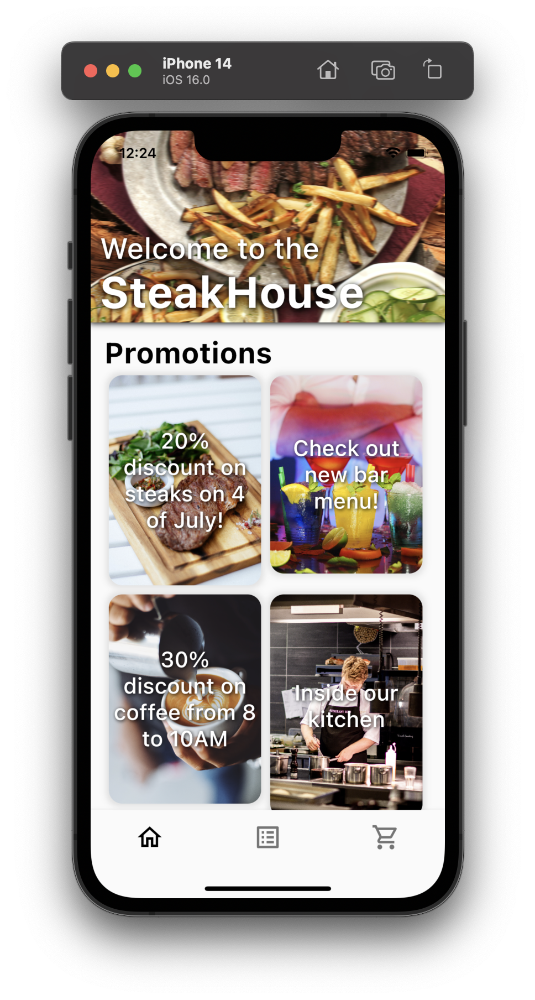

# food_delivery_app

Simple food delivery app which is created using Flutter.

## About application

Application has three screens: home screen, catalog screen, cart screen and additional product description screen.
Application does not use the database to retrieve data, everything is stored localy in classes. App is just mainly UI.

More soon.

## Screenshosts

