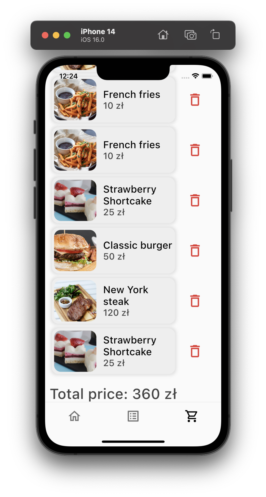

# food_delivery_app

Simple food delivery app which is created using Flutter.

## About application

Application will be able to retrieve data from remote database and display it.

More soon.

## Screenshosts

;
;
;
;
;
